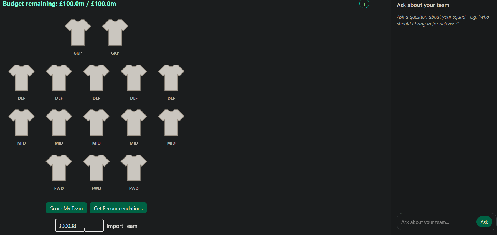
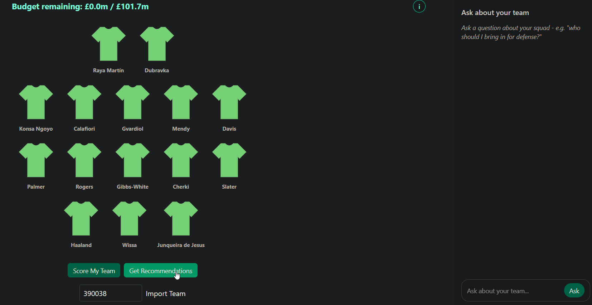
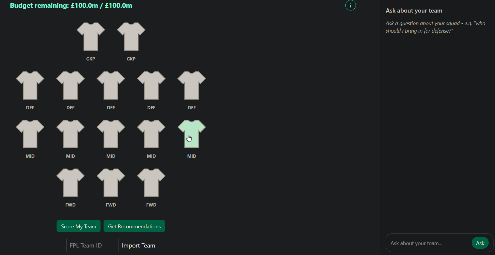
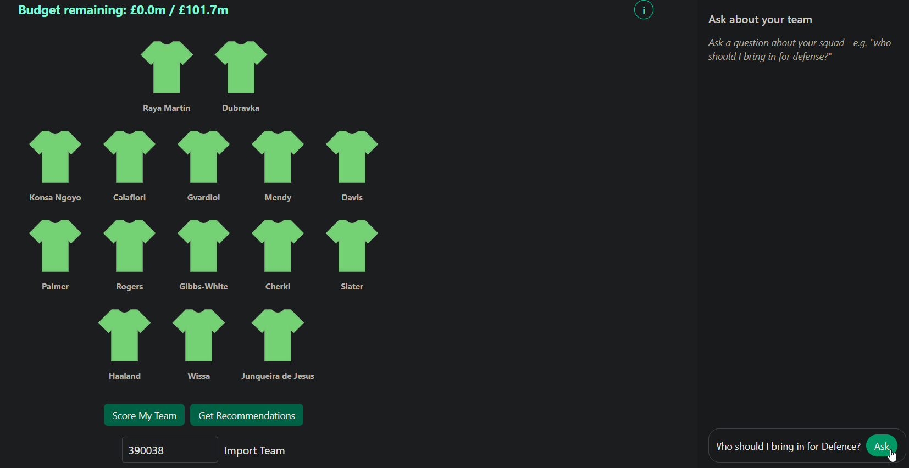

# Fantasy Football Aid

**[Try it live](https://fantasy-football-aid.vercel.app/)** - the first load can take up to a minute while the free server wakes up.

A Fantasy Premier League (FPL) assistant. Build a squad, or import your real one by team ID. The app scores every player in the league with its own algorithm and suggests who to add or upgrade within your budget. The app has an AI assistant that can explain its reasoning and make the necessary transfers for you to improve your squad!

Built with React, Flask, Tailwind CSS, SQLite and DeepSeek, using live data from the official FPL API.

## Features

- **Import your real team** - Enter your FPL team ID and your squad loads onto the pitch. Your budget is your squad's value plus your bank, the same as in the real game.

  

- **Recommendations for the whole squad** - One click checks every position. It suggests players to **add** where a position isn't full, and an **upgrade** for your weakest player where it is. Every suggestion stays within your budget and the squad rules.

  

- **Build a squad slot by slot** - Click any shirt to select a player, or ask for the best-scoring options that fit that slot, your remaining budget and team rules.

  

- **An AI assistant that can change your team** - Ask for recommendations in plain English, such as *"who should I bring in for defence?"*. When it recommends transfers, an **Apply these changes** button appears under its answer. Click it to have the AI's changes made automatically.

  


## Implementation details

- **AI assistant**: The assistant uses tool calling, answers come from the app's real scoring algorithm and never from made-up statistics. It can't edit your squad directly; it can only suggest player IDs through the `propose_changes` tool. [`propose_changes.py`](backend/tools/propose_changes.py) then checks positions, the 3-per-club limit and the budget to ensure that the players that the assistant is suggesting adhere to the game rules.
- **Scoring is position-specific**: Each position has its own weighted algorithm in [`backend/scorers/`](backend/scorers/). Goalkeepers are weighted on clean sheets and saves, for example, and forwards on goals and assists. Every statistic is normalised against players in the same position to give a score out of 100. Value for money (points per £m) carries 17–22% of the weight, and difficult upcoming fixtures count against a player as well.
- **Fresh data**: Player data comes from the official FPL API and is stored in SQLite. It refreshes automatically when the server starts if it's more than 12 hours old, so prices and stats stay current.
- **Tested**: The pytest suite runs against an in-memory database of made-up players, so the results don't change as real prices change. It covers the budget and squad rules, the recommendation logic, and the checks behind the AI's Apply button.

## Deployment

- **Frontend** is hosted on Vercel; **backend** on Render (free tier, so it sleeps when idle - hence the slow first load).
- Both redeploy automatically on every push to `main`.
- The frontend reads the backend address from `VITE_API_URL`, so the same code points at `127.0.0.1` locally and at Render in production.
- The backend runs under gunicorn in production instead of Flask's development server.

## Running locally

Needs Python, Node.js and a [DeepSeek API key](https://platform.deepseek.com/) in a `.env` file in the project root: `DEEPSEEK_API_KEY=your-key-here`

```bash
cd backend && pip install -r requirements.txt && python server.py   # terminal 1
cd frontend && npm install && npm run dev                           # terminal 2
```
